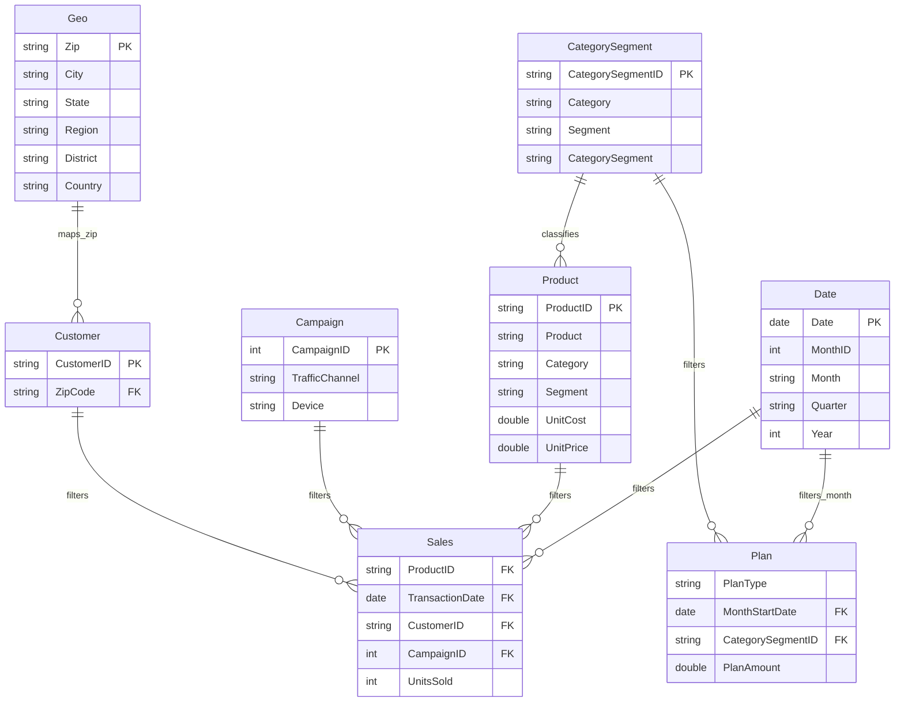

# Model Design — VanArsdel Sales Performance

## Handoff note

This document is a build specification for a DA to implement manually in Power BI Desktop. The final handoff focuses on requirements, model design, measures, and report layout.

## Recommended semantic model pattern

Use a clean star schema with two fact tables:

* `Sales` — daily actual sales lines.
* `Plan` — monthly Budget/Forecast at Category-Segment level.

Recommended dimensions:

* `Date`
* `Product`
* `CategorySegment` *(recommended bridge/conformed dimension for plan comparison)*
* `Campaign`
* `Customer`
* `Geo`
* `Key Measures` *(disconnected measures table)*

## Recommended model diagram



## Why create `CategorySegment`

Budget/Forecast is not at ProductID grain. If Plan is related directly to Product using Category and Segment, Power BI may create ambiguous many-to-many behavior and duplicate plan values when product-level filters are applied. A small conformed `CategorySegment` dimension makes the comparison explicit:

```text
CategorySegment[CategorySegmentID] 1 → many Product[CategorySegmentID]
CategorySegment[CategorySegmentID] 1 → many Plan[CategorySegmentID]
Product[ProductID] 1 → many Sales[ProductID]
```

For Budget Attainment pages, use CategorySegment fields for plan comparison. Do not place Product-level rows next to Budget unless an allocation rule is created.

## Required Power Query transformations

### Date

* Convert Excel serial dates to Date.
* Extend calendar to cover `2015-01-01` through `2021-12-31` if 2015 actuals stay in scope.
* Add / ensure sort columns: MonthNo, MonthID, Year, Quarter.

### Campaign

* Trim `TrafficChannel` and `Device`.
* Standardize after approval:
  * `Affliliate` → `Affiliate`
  * `Deskop` → `Desktop`
* Create `Channel Type` if approved:
  * `Offline` when Traffic Channel = `Mail` or Device = `Paper`.
  * `Digital` otherwise.

### Customer

* Force CustomerID and ZipCode to text.
* Hide or remove `Email Name`.

### Product

* Force ProductID and ManufacturerID to text.
* Rename Unit Price → Unit Selling Price.
* Create `CategorySegmentID = Category & "|" & Segment`.
* Create `Category-Segment = Category & "-" & Segment`.

### Sales

* Force ProductID and CustomerID to text.
* Convert Date serial to Date.
* Ensure Units stays whole number (source is already numeric in current workbook).
* Validate ProductID, CustomerID, CampaignID join coverage.

### Plan

* Skip first title row.
* Promote second row to headers.
* Unpivot all Category-Segment columns.
* Split Category-Segment to Category and Segment.
* Convert amount to decimal number.
* Create MonthNumber from MonthName.
* Create MonthStartDate and MonthID.
* Create CategorySegmentID.
* If reusing `Budget_Path.txt`, note it currently reads CSV (`Csv.Document`) and does not directly load the supplied `.xlsx` budget file.

## Relationship settings

| Relationship | Active | Cardinality | Cross-filter direction | Notes |
|---|---|---|---|---|
| Date[Date] → Sales[Transaction Date] | Yes | 1:* | Single | Date must cover actuals. |
| Product[Product ID] → Sales[Product ID] | Yes | 1:* | Single | Standard product filtering. |
| Campaign[Campaign ID] → Sales[Campaign ID] | Yes | 1:* | Single | Channel/device filtering. |
| Customer[Customer ID] → Sales[Customer ID] | Yes | 1:* | Single | Customer-level filtering. |
| Geo[Zip] → Customer[Zip Code] | Yes | 1:* | Single | Filters customers and sales via Customer. |
| Date[Date] → Plan[Month Start Date] | Yes | 1:* | Single | Monthly plans align to first day of month. |
| CategorySegment[CategorySegmentID] → Product[CategorySegmentID] | Yes | 1:* | Single | Enables category/segment product filtering. |
| CategorySegment[CategorySegmentID] → Plan[CategorySegmentID] | Yes | 1:* | Single | Enables category/segment plan filtering. |

## Measure implementation notes

* Place all explicit measures in `Key Measures`.
* Hide base keys and technical columns from report view.
* Use explicit measures only; avoid implicit sums.
* Budget measures should filter `Plan[Plan Type]` rather than requiring user slicers.
* Budget Attainment should return blank when Budget is blank/zero or when selected date is outside actual coverage.
* Add a report info tooltip that lists core assumptions: gross revenue, USD, actuals through 2020-06-30.

## Validation checks after build

| Check | Expected outcome |
|---|---|
| Sales row count | 675,368 |
| Units Sold total | 675,368 if all current rows have Units = 1 |
| Product missing in Sales | 0 missing ProductID |
| Campaign missing in Sales | 0 missing CampaignID |
| Date missing in Sales | 0 only if Date extended to 2015 |
| Budget rows after unpivot | 324 rows: 36 rows × 9 Category-Segment columns |
| Budget Attainment for Jan 2020 Urban-Moderation | Actual revenue near 285,568 vs Budget near 289,792 before filters |
